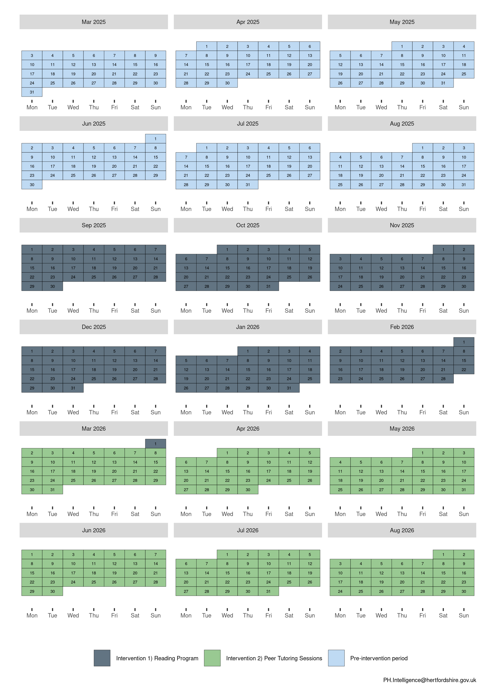

<!-- README.md is generated from README.Rmd. Please edit that file -->

# multipleITScontrol <a href="https://dplyr.tidyverse.org"></a>

<!-- badges: start -->

[](https://CRAN.R-project.org/package=multipleITScontrol)
[](https://app.codecov.io/gh/herts-phei/multipleITScontrol)
[](https://github.com/herts-phei/multipleITScontrol/actions/workflows/R-CMD-check.yaml)

<!-- badges: end -->

## Overview

The goal of multipleITScontrol is to provide functions to easily wrangle
data collected for an intervention and to perform interrupted time
series statistical analysis, involving tracking a long-term period
before and after a intervention at a defined point in time to assess the
intervention’s effects, along with methods allowing for comparing the
outcomes for the treated units with those of a control/comparison unit,
and to allow for multiple successive interventions.

Interrupted-time series (ITS) is a quasi-experimental study design for
evaluating the impact of an intervention or successive interventions
that are implemented at defined moments in time. This is much more
informative than an end-point analysis which only allows an
understanding of differences between the final situations, rather than
establishing how the different interventions influenced an outcome. In
practice, ITS models are useful to establish an underlying trend over
time and understand the effect of “interrupting” this trend with the
interventions that are implemented. The trend that would have been
expected to continue occurring without the intervention is called the
“counterfactual” scenario, and the impact of introducing the
intervention is typically determined by comparing whether there was a
difference in this counterfactual trend, and the trend that arose after
the intervention.

In a more complex situation however, a second counterfactual scenario
can be considered by introducing a “control” group that is not subject
to the intervention. A controlled ITS study helps in understanding the
effect of interventions when the underlying trend is expected to change
in a time-varied manner that has not been, or cannot be, accounted for.
For example, a possible scenario could be that the underlying trend will
change due to seasonality.

More information on ITS models and controlled ITS models can be found in
Lopez Bernal, Cummins, and Gasparrini (2016, 2018).

A lot of the code is derived and inspired from the rpub article [A
pragmatic Introduction to Interrupted Time
Series](https://rpubs.com/chrissyhroberts/1006858) by Chrissy Roberts,
many thanks goes to him.

## Installation

You can install the development version of multipleITScontrol from
[GitHub](https://github.com/) with:

``` r
# install.packages("pak")
pak::pak("herts-phei/multipleITScontrol")
```

## Pre-requisites

In order for the package functions to work properly, there are several
requirements to be met for the data frame containing the time series
data:

- To successfully implement an ITS model, data must be collected
  consistently before and after the intervention, which must be
  implemented at a defined point in time. For this package, a minimum of
  3 equal interval time points in each intervention period and in the
  pre-intervention period are needed

- Defined impact model whether the interventions were expected to result
  in a sudden change (a “level” or “step” change, or both); currently,
  the package only supports the same impact model for each intervention.

- Power calculations to ensure sufficient statistical power in the
  intervention of interest should be performed, but this is beyond the
  scope of the package and should be performed independently.

## Usage

This is a basic example which shows you how to solve a common problem
with two stage interrupted time series with a control:

**Background**: Alpine Meadow School and Forest Tiger School have
similar student demographics, including socioeconomic status, ethnicity,
and academic performance. Both schools are part of Clarkson County’s
public school district.

Alpine Meadow School wants to trial out two new interventions to improve
their school’s reading comprehension score, and to compare post
intervention results with the pre-intervention score.

**Intervention 1: Implementing a New Reading Programme**

- **Objective:** Improve reading comprehension and literacy rates among
  students.
- **Start Date:** September 1, 2025
- **Duration:** 6 months
- **Description:** The school introduces a new, evidence-based reading
  program that includes daily reading sessions, interactive reading
  activities, and regular assessments.
- **Measurement:** Reading comprehension scores from standardized tests
  administered weekly.

**Intervention 2: Introducing Peer Tutoring Sessions**

- **Objective:** Further enhance reading comprehension and literacy
  rates.
- **Start Date:** March 1, 2026 (immediately after the reading program
  ends)
- **Duration:** 6 months
- **Description:** The school implements peer tutoring sessions where
  older students tutor younger students in reading. These sessions are
  held twice a week and focus on reading comprehension strategies and
  practice.
- **Measurement:** Reading comprehension scores from standardized tests
  administered weekly.

### Controlled Interrupted Time Series Design

**Step 1: Baseline Period**

- **Duration:** 6 months (March 1, 2025 - August 31, 2025)
- **Data Collection:** Collect baseline data on reading comprehension
  scores administered weekly.

**Step 2: Intervention 1 Period**

- **Duration:** 6 months (September 1, 2025 - February 28, 2026)
- **Data Collection:** Continue collecting data on reading comprehension
  scores during the reading program administered weekly.

**Step 3: Intervention 2 Period**

- **Duration:** 6 months (March 1, 2026 - August 31, 2026)
- **Data Collection:** Collect data on reading comprehension scores
  during the peer tutoring sessions administered weekly.

The calendar plot below summarises the timeline of the interventions:



``` r
library(multipleITScontrol)
```

Further examples can be found in the vignette here.
