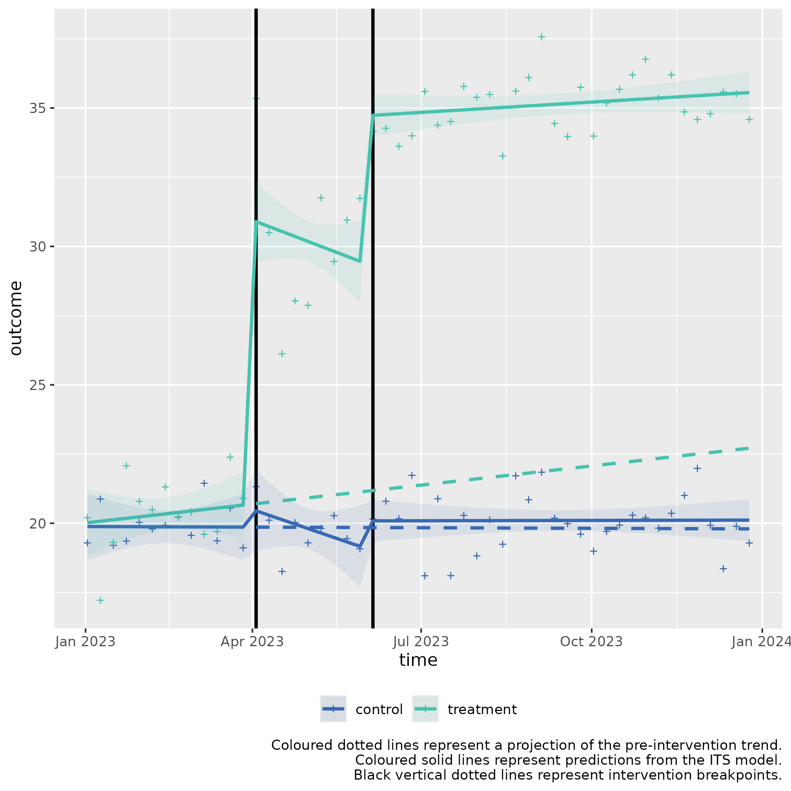

# Multiple ITS control introduction for level change (two-stage example)

### Usage

This is a basic example which shows how to solve a common problem with a
**two‑stage interrupted time series with a control**, for a **level
(step) change hypothesis**.

**Background:**

  
*MetroBike City* and *RiverCycle District* operate bicycle‑sharing
networks in neighbouring urban areas. Both systems use similar bicycles,
have comparable ridership patterns, and maintain similar maintenance
schedules.

In early 2023, MetroBike City implemented two sequential interventions
aimed at reducing **weekly maintenance incidents** (e.g., damaged gears,
brake faults, electronic lock failures). RiverCycle District made *no*
fleet-wide changes during the same period and serves as the **control**.

This example illustrates a scenario where **each intervention leads to a
significant immediate “step” decrease** in the number of maintenance
incidents, without slope changes.

#### **Intervention 1: Smart‑Lock Upgrade (Fleet‑wide)**

- **Objective:** Reduce lock‑related maintenance tickets.
- **Start Date:** April 3, 2023
- **Duration:** 2 months
- **Description:** All MetroBike bicycles received new smart‑locks with
  improved sensors, reducing jammed/failed locking events.
- **Measurement:** Weekly total maintenance incidents.

#### **Intervention 2: Predictive Maintenance Algorithm**

- **Objective:** Reduce mechanical faults through early detection.
- **Start Date:** June 5, 2023
- **Duration:** 2 months
- **Description:** The operator introduced an AI‑supported predictive
  system identifying bicycles likely to require maintenance before
  breakdowns occur.
- **Measurement:** Weekly total maintenance incidents.

#### Controlled Interrupted Time Series Design (2 stage)

**Step 1: Baseline Period**

- Duration: January 1, 2023 – April 2, 2023

- Weekly maintenance incident counts collected.

**Step 2: Intervention 1 Period**

- Duration: April 3, 2023 – June 4, 2023

**Step 3: Intervention 2 Period**

- Duration: June 5, 2023 – December 31, 2023

The calendar plot below summarises the timeline of the interventions:


## Step 1) Loading data

Sample data can be loaded from the package for this scenario through the
bundled dataset `its_data_medical_practice`.

  

  

This sample dataset demonstrates the format your own data should be in.

You can observe that in the `Date` column, that the dates are of equal
distance between each element, and that there are two rows for each
date, corresponding to either `control` or `treatment` in the
`group_var` variable. `control` and `treatment` each have three periods,
a `Pre-intervention period` detailing measurements of the outcome prior
to any intervention, the first intervention detailed by
`Intervention 1) Smart-Lock Upgrade`, and the second intervention,
detailed by `Intervention 2) Predictive Maintenance Algorithm`.

  

## Step 2) Transforming the data

The data frame should be passed to `multipleITScontrol::tranform_data()`
with suitable arguments selected, specifying the names of the columns to
the required variables and starting intervention time points.

``` r
intervention_dates <- c(as.Date("2023-04-03"), as.Date("2023-06-05"))
transformed_data <- 
  multipleITScontrol::transform_data(df = tibble_data,
               time_var = "Date",
               group_var = "group_var",
               outcome_var =  "score",
               intervention_dates = intervention_dates)
```

Returns the initial data frame with a few transformed variables needed
for interrupted time series.

    #> # A tibble: 104 × 11
    #> # Groups:   category [2]
    #>    time       category  Period   outcome     x time_index level_pre_intervention
    #>    <date>     <chr>     <chr>      <dbl> <dbl>      <int>                  <dbl>
    #>  1 2023-01-02 treatment Pre-int…    20.2     1          1                      1
    #>  2 2023-01-02 control   Pre-int…    19.3     0          1                      1
    #>  3 2023-01-09 treatment Pre-int…    17.2     1          2                      1
    #>  4 2023-01-09 control   Pre-int…    20.9     0          2                      1
    #>  5 2023-01-16 treatment Pre-int…    19.3     1          3                      1
    #>  6 2023-01-16 control   Pre-int…    19.2     0          3                      1
    #>  7 2023-01-23 treatment Pre-int…    22.1     1          4                      1
    #>  8 2023-01-23 control   Pre-int…    19.4     0          4                      1
    #>  9 2023-01-30 treatment Pre-int…    20.8     1          5                      1
    #> 10 2023-01-30 control   Pre-int…    20.0     0          5                      1
    #> # ℹ 94 more rows
    #> # ℹ 4 more variables: level_1_intervention <dbl>, slope_1_intervention <dbl>,
    #> #   level_2_intervention <dbl>, slope_2_intervention <dbl>

## Step 3) Fitting ITS model

The transformed data is then fit using
[`multipleITScontrol::fit_its_model()`](https://herts-phei.github.io/multipleITScontrol/reference/fit_its_model.md).
Required arguments are `transformed_data`, which is simply an unmodified
object created from
[`multipleITScontrol::transform_data()`](https://herts-phei.github.io/multipleITScontrol/reference/transform_data.md)
in the step above; a defined impact model, with current options being
either ‘*slope*’, \`*level*, or ‘*levelslope*’, and the number of
interventions.

``` r
fitted_ITS_model <-
  multipleITScontrol::fit_its_model(transformed_data = transformed_data,
                                    impact_model = "level",
                                    num_interventions = 2)

fitted_ITS_model
```

Gives a conventional model output from
[`nlme::gls()`](https://rdrr.io/pkg/nlme/man/gls.html).

    #> Generalized least squares fit by REML
    #>   Model: reformulate(termlabels = termlabels, response = "outcome") 
    #>   Data: transformed_data 
    #>   Log-restricted-likelihood: -171.1073
    #> 
    #> Coefficients:
    #>            (Intercept)                      x             time_index 
    #>           19.883565462            0.085891041           -0.001662707 
    #>   level_1_intervention   level_2_intervention   slope_1_intervention 
    #>            0.748323339            1.667192505           -0.158756239 
    #>   slope_2_intervention           x:time_index x:level_1_intervention 
    #>            0.161385436            0.054395358            9.670410648 
    #> x:level_2_intervention x:slope_1_intervention x:slope_2_intervention 
    #>           13.994252247           -0.072810187            0.045789700 
    #> 
    #> Correlation Structure: ARMA(5,1)
    #>  Formula: ~time_index | x 
    #>  Parameter estimate(s):
    #>        Phi1        Phi2        Phi3        Phi4        Phi5      Theta1 
    #> -0.31105009  0.14077680 -0.18620023 -0.27429005 -0.01016831  0.42605701 
    #> Degrees of freedom: 104 total; 92 residual
    #> Residual standard error: 1.242543

## Step 4) Analysing ITS model

However, the coefficients given do not make intuitive sense to a lay
person. We can call the package’s internal
[`multipleITScontrol::summary_its()`](https://herts-phei.github.io/multipleITScontrol/reference/summary_its.md)
which modifies the summary output by renaming the coefficients, variable
names, and other model-related terms to make them easier to interpret in
the context of interrupted time series (ITS) analysis.

``` r
my_summary_its_model <- multipleITScontrol::summary_its(fitted_ITS_model)

my_summary_its_model
```

    #> Generalized least squares fit by REML
    #>   Model: reformulate(termlabels = termlabels, response = "outcome") 
    #>   Data: transformed_data 
    #>   Log-restricted-likelihood: -171.1073
    #> 
    #> Coefficients:
    #>                           A) Control y-axis intercept 
    #>                                          19.883565462 
    #>       B) Pilot y-axis intercept difference to control 
    #>                                           0.085891041 
    #>                     C) Control pre-intervention slope 
    #>                                          -0.001662707 
    #>                       G) Control intervention 1 level 
    #>                                           0.748323339 
    #>                       K) Control intervention 2 level 
    #>                                           1.667192505 
    #>                       E) Control intervention 1 slope 
    #>                                          -0.158756239 
    #>                       I) Control intervention 2 slope 
    #>                                           0.161385436 
    #> D) Pilot pre-intervention slope difference to control 
    #>                                           0.054395358 
    #>   H) Pilot intervention 1 level difference to control 
    #>                                           9.670410648 
    #>   L) Pilot intervention 2 level difference to control 
    #>                                          13.994252247 
    #>                         F) Pilot intervention 1 slope 
    #>                                          -0.072810187 
    #>                         J) Pilot intervention 2 slope 
    #>                                           0.045789700 
    #> 
    #> Correlation Structure: ARMA(5,1)
    #>  Formula: ~time_index | x 
    #>  Parameter estimate(s):
    #>        Phi1        Phi2        Phi3        Phi4        Phi5      Theta1 
    #> -0.31105009  0.14077680 -0.18620023 -0.27429005 -0.01016831  0.42605701 
    #> Degrees of freedom: 104 total; 92 residual
    #> Residual standard error: 1.242543

``` r
summary(my_summary_its_model)
```

    #> Generalized least squares fit by REML
    #>   Model: reformulate(termlabels = termlabels, response = "outcome") 
    #>   Data: transformed_data 
    #>        AIC      BIC    logLik
    #>   380.2145 428.1285 -171.1073
    #> 
    #> Correlation Structure: ARMA(5,1)
    #>  Formula: ~time_index | x 
    #>  Parameter estimate(s):
    #>        Phi1        Phi2        Phi3        Phi4        Phi5      Theta1 
    #> -0.31105009  0.14077680 -0.18620023 -0.27429005 -0.01016831  0.42605701 
    #> 
    #> Coefficients:
    #>                                                           Value Std.Error
    #> A) Control y-axis intercept                           19.883565 0.6967789
    #> B) Pilot y-axis intercept difference to control        0.085891 0.9853942
    #> C) Control pre-intervention slope                     -0.001663 0.0893233
    #> G) Control intervention 1 level                        0.748323 1.1459476
    #> K) Control intervention 2 level                        1.667193 1.7174595
    #> E) Control intervention 1 slope                       -0.158756 0.1800796
    #> I) Control intervention 2 slope                        0.161385 0.1632444
    #> D) Pilot pre-intervention slope difference to control  0.054395 0.1263223
    #> H) Pilot intervention 1 level difference to control    9.670411 1.6206146
    #> L) Pilot intervention 2 level difference to control   13.994252 2.4288545
    #> F) Pilot intervention 1 slope                         -0.072810 0.2546711
    #> J) Pilot intervention 2 slope                          0.045790 0.2308625
    #>                                                         t-value p-value
    #> A) Control y-axis intercept                           28.536405  0.0000
    #> B) Pilot y-axis intercept difference to control        0.087164  0.9307
    #> C) Control pre-intervention slope                     -0.018614  0.9852
    #> G) Control intervention 1 level                        0.653017  0.5154
    #> K) Control intervention 2 level                        0.970732  0.3342
    #> E) Control intervention 1 slope                       -0.881589  0.3803
    #> I) Control intervention 2 slope                        0.988612  0.3254
    #> D) Pilot pre-intervention slope difference to control  0.430608  0.6678
    #> H) Pilot intervention 1 level difference to control    5.967125  0.0000
    #> L) Pilot intervention 2 level difference to control    5.761667  0.0000
    #> F) Pilot intervention 1 slope                         -0.285899  0.7756
    #> J) Pilot intervention 2 slope                          0.198342  0.8432
    #> 
    #>  Correlation: 
    #>                                                       A)Cy-i BPyidtc C)Cp-s
    #> B) Pilot y-axis intercept difference to control       -0.707               
    #> C) Control pre-intervention slope                     -0.903  0.639        
    #> G) Control intervention 1 level                        0.349 -0.246  -0.542
    #> K) Control intervention 2 level                        0.237 -0.168  -0.372
    #> E) Control intervention 1 slope                        0.414 -0.292  -0.430
    #> I) Control intervention 2 slope                        0.038 -0.027  -0.073
    #> D) Pilot pre-intervention slope difference to control  0.639 -0.903  -0.707
    #> H) Pilot intervention 1 level difference to control   -0.246  0.349   0.383
    #> L) Pilot intervention 2 level difference to control   -0.168  0.237   0.263
    #> F) Pilot intervention 1 slope                         -0.292  0.414   0.304
    #> J) Pilot intervention 2 slope                         -0.027  0.038   0.052
    #>                                                       G)Ci1l K)Ci2l E)Ci1s
    #> B) Pilot y-axis intercept difference to control                           
    #> C) Control pre-intervention slope                                         
    #> G) Control intervention 1 level                                           
    #> K) Control intervention 2 level                        0.885              
    #> E) Control intervention 1 slope                       -0.423 -0.636       
    #> I) Control intervention 2 slope                        0.759  0.868 -0.860
    #> D) Pilot pre-intervention slope difference to control  0.383  0.263  0.304
    #> H) Pilot intervention 1 level difference to control   -0.707 -0.625  0.299
    #> L) Pilot intervention 2 level difference to control   -0.625 -0.707  0.449
    #> F) Pilot intervention 1 slope                          0.299  0.449 -0.707
    #> J) Pilot intervention 2 slope                         -0.537 -0.614  0.608
    #>                                                       I)Ci2s DPpsdtc HPi1ldtc
    #> B) Pilot y-axis intercept difference to control                              
    #> C) Control pre-intervention slope                                            
    #> G) Control intervention 1 level                                              
    #> K) Control intervention 2 level                                              
    #> E) Control intervention 1 slope                                              
    #> I) Control intervention 2 slope                                              
    #> D) Pilot pre-intervention slope difference to control  0.052                 
    #> H) Pilot intervention 1 level difference to control   -0.537 -0.542          
    #> L) Pilot intervention 2 level difference to control   -0.614 -0.372   0.885  
    #> F) Pilot intervention 1 slope                          0.608 -0.430  -0.423  
    #> J) Pilot intervention 2 slope                         -0.707 -0.073   0.759  
    #>                                                       LPi2ldtc F)Pi1s
    #> B) Pilot y-axis intercept difference to control                      
    #> C) Control pre-intervention slope                                    
    #> G) Control intervention 1 level                                      
    #> K) Control intervention 2 level                                      
    #> E) Control intervention 1 slope                                      
    #> I) Control intervention 2 slope                                      
    #> D) Pilot pre-intervention slope difference to control                
    #> H) Pilot intervention 1 level difference to control                  
    #> L) Pilot intervention 2 level difference to control                  
    #> F) Pilot intervention 1 slope                         -0.636         
    #> J) Pilot intervention 2 slope                          0.868   -0.860
    #> 
    #> Standardized residuals:
    #> numeric(0)
    #> attr(,"label")
    #> [1] "Standardized residuals"
    #> 
    #> Residual standard error: 1.242543 
    #> Degrees of freedom: 104 total; 92 residual

## Step 5) Fitting Predictions

We can fit predictions with the created model which project the
pre-intervention period into the post-intervention period by using the
model coefficients using
[`multipleITScontrol::generate_predictions()`](https://herts-phei.github.io/multipleITScontrol/reference/generate_predictions.md).

``` r
transformed_data_with_predictions <- generate_predictions(transformed_data, fitted_ITS_model)

transformed_data_with_predictions
```

### Step 6) Plotting the results

We can use the predicted values and map the segmented regression lines
which compare whether an intervention had a statistically significant
difference.

``` r
its_plot(model = my_summary_its_model,
         data_with_predictions = transformed_data_with_predictions, 
         time_var = "time",
         intervention_dates = intervention_dates)
```


