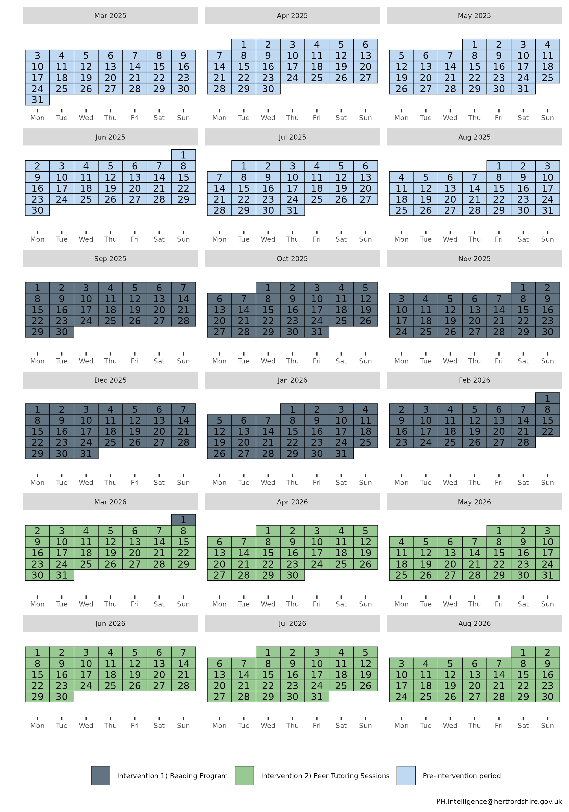
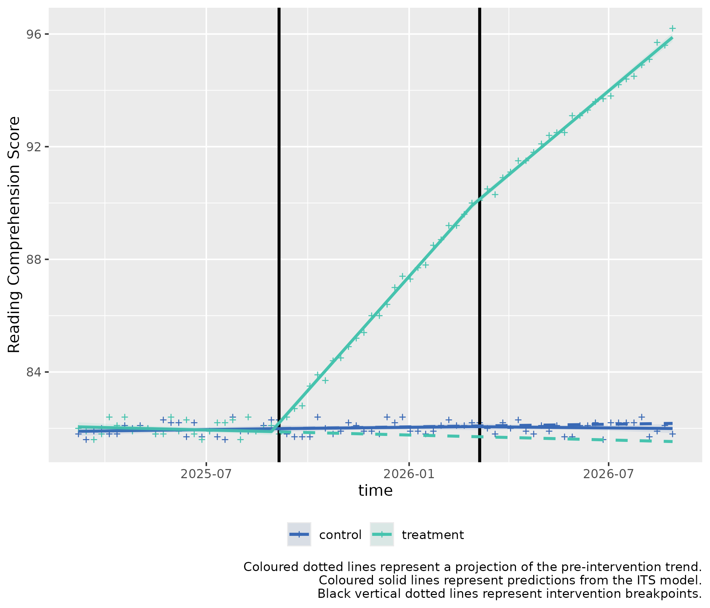

# Multiple ITS control introduction for slope change

### Usage

This is a basic example which shows you how to solve a common problem
with two stage interrupted time series with a control for a slope
hypothesis:

**Background**: *Alpine Meadow School* (AMS) and *Forest Tiger School*
(FTS) have similar student demographics, including socioeconomic status,
ethnicity, and academic performance. Both schools are part of Clarkson
County’s public school district.

*Alpine Meadow School* wants to trial out two new interventions to
improve their school’s reading comprehension score, and to compare post
intervention results with the pre-intervention score.

**Intervention 1: Implementing a New Reading Programme**

- **Objective:** Improve reading comprehension and literacy rates among
  students.
- **Start Date:** September 1, 2025
- **Duration:** 6 months
- **Description:** The school introduces a new, evidence-based reading
  program that includes daily reading sessions, interactive reading
  activities, and regular assessments.
- **Measurement:** Reading comprehension scores from standardized tests
  administered weekly.

**Intervention 2: Introducing Peer Tutoring Sessions**

- **Objective:** Further enhance reading comprehension and literacy
  rates.
- **Start Date:** March 2, 2026 (immediately after the reading program
  ends)
- **Duration:** 6 months
- **Description:** The school implements peer tutoring sessions where
  older students tutor younger students in reading. These sessions are
  held twice a week and focus on reading comprehension strategies and
  practice.
- **Measurement:** Reading comprehension scores from standardized tests
  administered and marked weekly on Friday.

#### Controlled Interrupted Time Series Design (2 stage)

**Step 1: Baseline Period**

- **Duration:** 6 months (March 3, 2025 - August 31, 2025)
- **Data Collection:** Collect baseline data on reading comprehension
  scores administered weekly.

**Step 2: Intervention 1 Period**

- **Duration:** 6 months (September 1, 2025 - March 1, 2026)
- **Data Collection:** Continue collecting data on reading comprehension
  scores during the reading program administered weekly.

**Step 3: Intervention 2 Period**

- **Duration:** 6 months (March 2, 2026 - August 31, 2026)
- **Data Collection:** Collect data on reading comprehension scores
  during the peer tutoring sessions administered weekly.

The school hypothesizes there will be a **slope** effect for the
interventions.

The calendar plot below summarises the timeline of the interventions:



## Step 1) Loading data

Sample data can be loaded from the package for this scenario through the
bundled dataset `its_data_school`.

  

  

This sample dataset demonstrates the format your own data should be in.

You can observe that in the `Date` column, that the dates are of equal
distance between each element, and that there are two rows for each
date, corresponding to either `control` or `treatment` in the
`group_var` variable. `control` and `treatment` each have three periods,
a `Pre-intervention period` detailing measurements of the outcome prior
to any intervention, the first intervention detailed by
`Intervention 1) Reading Programme`, and the second intervention,
detailed by `Intervention 2) Peer Tutoring Sessions`.

  

## Step 2) Transforming the data

The data frame should be passed to
**`multipleITScontrol::tranform_data()`** with suitable arguments
selected, specifying the names of the columns to the required variables
and starting intervention time points.

``` r
transformed_data <- 
  multipleITScontrol::transform_data(df = its_data_school,
                                     time_var = "Date",
                                     group_var = "group_var",
                                     outcome_var = "score",
                                     intervention_dates = as.Date(c("2025-09-05", "2026-03-06")))
```

Returns the initial data frame with a few transformed variables needed
for interrupted time series.

    #> # A tibble: 156 × 13
    #> # Groups:   category [2]
    #>    time       category  Period   outcome     x time_index level_pre_intervention
    #>    <date>     <chr>     <chr>      <dbl> <dbl>      <int>                  <dbl>
    #>  1 2025-03-07 treatment Pre-int…    82       1          1                      1
    #>  2 2025-03-07 control   Pre-int…    81.8     0          1                      1
    #>  3 2025-03-14 treatment Pre-int…    81.9     1          2                      1
    #>  4 2025-03-14 control   Pre-int…    81.6     0          2                      1
    #>  5 2025-03-21 treatment Pre-int…    81.6     1          3                      1
    #>  6 2025-03-21 control   Pre-int…    81.9     0          3                      1
    #>  7 2025-03-28 treatment Pre-int…    81.8     1          4                      1
    #>  8 2025-03-28 control   Pre-int…    82       0          4                      1
    #>  9 2025-04-04 treatment Pre-int…    82.4     1          5                      1
    #> 10 2025-04-04 control   Pre-int…    81.8     0          5                      1
    #> # ℹ 146 more rows
    #> # ℹ 6 more variables: level_1_intervention <dbl>,
    #> #   level_1_intervention_internal <dbl>, slope_1_intervention <dbl>,
    #> #   level_2_intervention <dbl>, level_2_intervention_internal <dbl>,
    #> #   slope_2_intervention <dbl>

## Step 3) Fitting ITS model

The transformed data is then fit using
[`multipleITScontrol::fit_its_model()`](https://herts-phei.github.io/multipleITScontrol/reference/fit_its_model.md).
Required arguments are `transformed_data`, which is simply an unmodified
object created from
[`multipleITScontrol::transform_data()`](https://herts-phei.github.io/multipleITScontrol/reference/transform_data.md)
in the step above; a defined impact model, with current options being
either ‘*slope*’, \`*level*, or ‘*levelslope*’, and the number of
interventions.

``` r
fitted_ITS_model <- 
  multipleITScontrol::fit_its_model(transformed_data = transformed_data,
                                    impact_model = "slope",
                                    num_interventions = 2)

fitted_ITS_model
```

Gives a conventional model output from
[`nlme::gls()`](https://rdrr.io/pkg/nlme/man/gls.html).

    #> Generalized least squares fit by REML
    #>   Model: reformulate(termlabels = termlabels, response = "outcome") 
    #>   Data: transformed_data 
    #>   Log-restricted-likelihood: -6.415746
    #> 
    #> Coefficients:
    #>            (Intercept)                      x             time_index 
    #>          81.8918689038           0.1684906811           0.0036366478 
    #>   slope_1_intervention   slope_2_intervention           x:time_index 
    #>          -0.0008224051          -0.0053395145          -0.0104209401 
    #> x:slope_1_intervention x:slope_2_intervention 
    #>           0.3161441555          -0.0732359132 
    #> 
    #> Correlation Structure: ARMA(4,5)
    #>  Formula: ~time_index | x 
    #>  Parameter estimate(s):
    #>        Phi1        Phi2        Phi3        Phi4      Theta1      Theta2 
    #> -0.04681337 -0.97435355 -0.29773087 -0.35723256  0.11056398  1.23972149 
    #>      Theta3      Theta4      Theta5 
    #>  0.26020519  0.48242891  0.21410072 
    #> Degrees of freedom: 156 total; 148 residual
    #> Residual standard error: 0.2161623

## Step 4) Analysing ITS model

However, the coefficients given do not make intuitive sense to a lay
person. We can call the package’s
**[`multipleITScontrol::summary_its()`](https://herts-phei.github.io/multipleITScontrol/reference/summary_its.md)**
function which modifies the summary output by renaming the coefficients
to make them easier to interpret in the context of interrupted time
series (ITS) analysis.

``` r
my_summary_its_model <- multipleITScontrol::summary_its(fitted_ITS_model)

my_summary_its_model
```

    #> Generalized least squares fit by REML
    #>   Model: reformulate(termlabels = termlabels, response = "outcome") 
    #>   Data: transformed_data 
    #>   Log-restricted-likelihood: -6.415746
    #> 
    #> Coefficients:
    #>                           A) Control y-axis intercept 
    #>                                         81.8918689038 
    #>       B) Pilot y-axis intercept difference to control 
    #>                                          0.1684906811 
    #>                     C) Control pre-intervention slope 
    #>                                          0.0036366478 
    #>                       E) Control intervention 1 slope 
    #>                                         -0.0008224051 
    #>                       I) Control intervention 2 slope 
    #>                                         -0.0053395145 
    #> D) Pilot pre-intervention slope difference to control 
    #>                                         -0.0104209401 
    #>                         F) Pilot intervention 1 slope 
    #>                                          0.3161441555 
    #>                         J) Pilot intervention 2 slope 
    #>                                         -0.0732359132 
    #> 
    #> Correlation Structure: ARMA(4,5)
    #>  Formula: ~time_index | x 
    #>  Parameter estimate(s):
    #>        Phi1        Phi2        Phi3        Phi4      Theta1      Theta2 
    #> -0.04681337 -0.97435355 -0.29773087 -0.35723256  0.11056398  1.23972149 
    #>      Theta3      Theta4      Theta5 
    #>  0.26020519  0.48242891  0.21410072 
    #> Degrees of freedom: 156 total; 148 residual
    #> Residual standard error: 0.2161623

``` r
sjPlot::tab_model(
  my_summary_its_model,
  dv.labels = "Average School Result",
  show.se = TRUE,
  collapse.se = TRUE,
  linebreak = FALSE,
  string.est = "Estimate (std. error)",
  string.ci = "95% CI",
  p.style = "numeric_stars"
)
```

[TABLE]

The predictor coefficients elucidate a few things:

### **Pre-intervention period:**

At the start of the pre-intervention period, ***A)*** ***Control y-axis
intercept*** represents the modelled starting mark of Forest Tiger
School, 81.89.

***C) Control pre-intervention slope*** describes the pre-intervention
slope in the control group (0).

***D) Pilot pre-intervention slope difference to control*** describes
the difference in the pre-intervention slope in the control group with
the pilot group. This coefficient is additive to C) ***Control
pre-intervention slope***. I.e. 0 (C) + -0.01 (D) = -0.01 is the
pre-intervention slope per x-axis unit in the pilot data.

### **First intervention**:

***E) Control intervention 1 slope*** describes the slope change that
occurs at the intervention break point in the control group at the start
of the first intervention, compared to it’s pre-intervention period (0).

***F) Pilot intervention 1 slope*** describes the difference in the
slope change that occurs at the intervention timepoint in the control
group for the first intervention compared to the pilot (0.32).

These slope changes are pertinent to the slope gradients given in the
pre-intervention period. Thus, we add the coefficients ***E)***
***Control intervention 1 slope** to **C)*** ***Control pre-intervention
slope***: 0 + 0 = 0 is the average increase for each x-axis unit during
the first intervention for the control data.

To ascertain the slope for the pilot data, we add to the
pre-intervention slope of the pilot data, the coefficients ***E)***
***Control intervention 1 slope*** and ***F)*** ***Pilot intervention 1
slope***. ***E*** (0) + ***F*** (0.32) + ***(C)*** 0 + ***D*** -0.01 (D)
= 0.31 is the average increase for each x-axis unit during the first
intervention for the pilot data.

To ascertain statistical significance with the first intervention slope,
we call the function’s
[`multipleITScontrol::slope_difference()`](https://herts-phei.github.io/multipleITScontrol/reference/slope_difference.md).

``` r
slope_difference(model = my_summary_its_model, intervention = 1)
```

    #> ## INTERVENTION  1 ## 
    #> 
    #>  Slope for treatment per x-axis unit: 0.31 
    #>  Slope for control per x-axis unit: 0 
    #>  Slope difference: 0.31 
    #>  95% CI: 0.29 to 0.32 
    #>  p-value: <0.001 
    #>  Slope control coefficients: E+C 
    #>  Slope treatment coefficients: E+C+D+F 
    #> 
    #> # A tibble: 9 × 3
    #>   Variable                      Value_Raw Value_Formatted
    #>   <chr>                             <dbl> <chr>          
    #> 1 Intervention                  1   e+  0 1              
    #> 2 Slope for treatment           3.09e-  1 0.31           
    #> 3 Slope for control             2.81e-  3 0              
    #> 4 Slope difference              3.06e-  1 0.31           
    #> 5 Lower 95% CI                  2.95e-  1 0.29           
    #> 6 Upper 95% CI                  3.16e-  1 0.32           
    #> 7 p.value                       1.06e-101 <0.001         
    #> 8 Slope treatment coefficients NA         E+C+D+F        
    #> 9 Slope control coefficients   NA         E+C

This brings up the key coefficients and values needed to compare the
slopes of the pilot and control during the first intervention.

We identify that the slope difference between the treatment (Alpine
Meadow School) and the control (Forest Tiger School) for the first
intervention (Reading Programme) has a slope difference of 0.31 (95% CI:
0.29 - 0.32) per x-axis unit, with a p-value below 0.05, indicating
statistical significance.

### **Second intervention:**

***I) Control intervention 2 slope*** describes the slope change that
occurs at the intervention break point in the control group at the start
of the second intervention (-0.01).

Thus, the modelled slope change in the second intervention is ***C)
Control pre-intervention slope*** (0) + **E) Control intervention 1
slope** (0) + ***I) Control intervention 2 slope*** (-0.01) = -0.01 is
the average cumulative uptake increase for each x-axis unit during the
second intervention for the control data.

***J) Pilot intervention 2 slope*** describes the difference in the
slope change that occurs at the intervention timepoint in the control
group for the second intervention. (-0.07).

These slope changes are pertinent to the slope gradients given in the
pre-intervention and first intervention period. Thus, we add the
coefficients ***C*** (0) + ***D*** (-0.01) + ***E*** (0) + ***F***
(0.32) + ***I*** (-0.01) + ***J*** (-0.07) = 0.23 is the average
cumulative increase for each x-axis unit during the second intervention
for the pilot data.

To ascertain statistical significance with the second intervention
slope, we call the function’s
[`multipleITScontrol::slope_difference()`](https://herts-phei.github.io/multipleITScontrol/reference/slope_difference.md)
again, but change the intervention parameter.

``` r
slope_difference(model = my_summary_its_model, intervention = 2)
```

    #> ## INTERVENTION  2 ## 
    #> 
    #>  Slope for treatment per x-axis unit: 0.23 
    #>  Slope for control per x-axis unit: 0 
    #>  Slope difference: 0.23 
    #>  95% CI: 0.22 to 0.25 
    #>  p-value: <0.001 
    #>  Slope control coefficients: E+C+I 
    #>  Slope treatment coefficients: E+C+D+F+I+J 
    #> 
    #> # A tibble: 9 × 3
    #>   Variable                     Value_Raw Value_Formatted
    #>   <chr>                            <dbl> <chr>          
    #> 1 Intervention                  2   e+ 0 2              
    #> 2 Slope for treatment           2.30e- 1 0.23           
    #> 3 Slope for control            -2.53e- 3 0              
    #> 4 Slope difference              2.32e- 1 0.23           
    #> 5 Lower 95% CI                  2.20e- 1 0.22           
    #> 6 Upper 95% CI                  2.45e- 1 0.25           
    #> 7 p.value                       5.09e-75 <0.001         
    #> 8 Slope treatment coefficients NA        E+C+D+F+I+J    
    #> 9 Slope control coefficients   NA        E+C+I

We identify that the slope difference between the treatment (Alpine
Meadow School) and the control (Forest Tiger School) for the first
intervention (Reading Programme) has a slope difference of 0.23 (95% CI:
0.22 - 0.25) per x-axis unit, with a p-value below 0.05, indicating
statistical significance. The effect has been attenuated compared to the
first intervention, and this is evident from the plot in step 6.

## Step 5) Fitting Predictions

We can fit predictions with the created model which project the
pre-intervention period into the post-intervention period by using the
model coefficients using
**[`multipleITScontrol::generate_predictions()`](https://herts-phei.github.io/multipleITScontrol/reference/generate_predictions.md)**.

``` r
transformed_data_with_predictions <- generate_predictions(transformed_data, fitted_ITS_model)

transformed_data_with_predictions
```

## Step 6) Plotting the results

We can use the predicted values and map the segmented regression lines
which compare whether an intervention had a statistically significant
difference.

``` r
its_plot(model = my_summary_its_model,
         data_with_predictions = transformed_data_with_predictions,
         time_var = "time",
         intervention_dates = as.Date(c("2025-09-05", "2026-03-06")), 
         y_axis = "Reading Comprehension Score")
```


