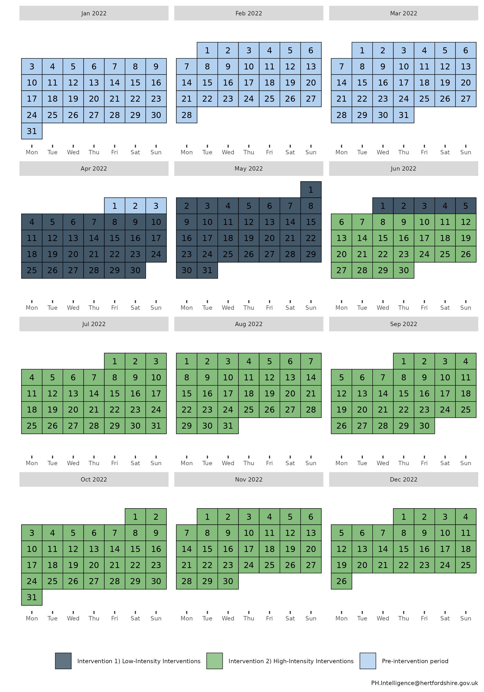
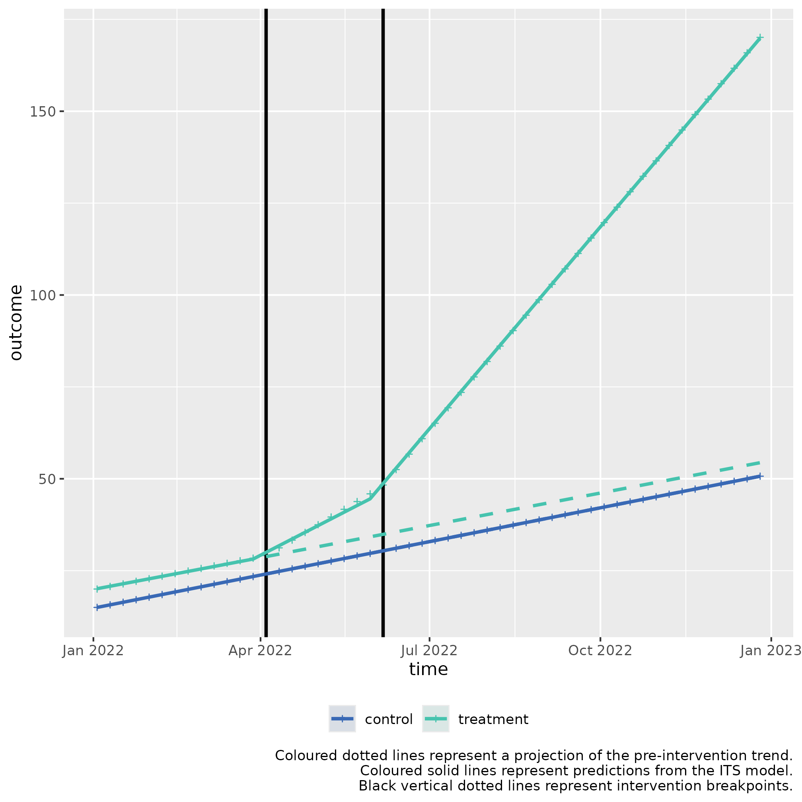

# Multiple ITS control introduction for slope 2 (second example)

### Usage

This is a basic example which shows you how to solve a common problem
with two stage interrupted time series with a control for a slope
hypothesis:

**Background**: *Albridge Medical Practice* and *Hollybush Medical
Practice* are two medical practices within the same PCN, with similar
populations of people, and prevalence of disease.

*Albridge Medical Practice* wants to try a new intervention to improve
wellbeing in people diagnosed with depression in their practice.

This example is for scenarios where there is a statistically significant
slope change for both interventions, but no level change.

**Intervention 1: Implementing a new Mental Health Support programme**

- **Objective:** Improve mental wellbeing in patients with low-to-mid
  level depression.
- **Start Date:** April 4, 2022
- **Duration:** 2 months
- **Description:** The practice introduced weekly Mindfulness Workshops,
  teaching meditation and breathing techniques to improve
  self-regulation.
- **Measurement:** Self-reported wellbeing scores measured at start and
  end of intervention.

**Intervention 2: Introducing CBT session**

- **Objective:** Further increase self-reported wellbeing scores.
- **Start Date:** June 6, 2022 (immediately after the intervention 1
  program ends)
- **Duration:** 6 months
- **Description:** The practice implements cognitive behavioural therapy
  (CBT) sessions, aimed at changing negative thought patterns and
  behaviours.
- **Measurement:** Self-reported wellbeing scores measured at start and
  end of intervention.

#### Controlled Interrupted Time Series Design (2 stage)

**Step 1: Baseline Period**

- **Duration:** 3 months (Jan 1, 2022 - April 3, 2022)
- **Data Collection:** Collect self-reported wellbeing scores.

**Step 2: Intervention 1 Period**

- **Duration:** 2 months (April 4, 2022 - June 5, 2022)
- **Data Collection:** Continue collecting self-reported wellbeing
  scores at end of workshops.

**Step 3: Intervention 2 Period**

- **Duration:** 6 months (June 6, 2022 - Dec 31, 2022)
- **Data Collection:** Continue collecting self-reported wellbeing
  scores at end of CBT.

The calendar plot below summarises the timeline of the interventions:



## Step 1) Loading data

Sample data can be loaded from the package for this scenario through the
bundled dataset `its_data_medical_practice`.

  

  

This sample dataset demonstrates the format your own data should be in.

You can observe that in the `Date` column, that the dates are of equal
distance between each element, and that there are two rows for each
date, corresponding to either `control` or `treatment` in the
`group_var` variable. `control` and `treatment` each have three periods,
a `Pre-intervention period` detailing measurements of the outcome prior
to any intervention, the first intervention detailed by
`Intervention 1) Implementing a new Mental Health Support programme`,
and the second intervention, detailed by
`Intervention 2) Introducing CBT session`.

  

## Step 2) Transforming the data

The data frame should be passed to `multipleITScontrol::tranform_data()`
with suitable arguments selected, specifying the names of the columns to
the required variables and starting intervention time points.

``` r
intervention_dates <- c(as.Date("2022-04-04"), as.Date("2022-06-06"))
transformed_data <- 
  multipleITScontrol::transform_data(df = tibble_data,
               time_var = "Date",
               group_var = "group_var",
               outcome_var =  "score",
               intervention_dates = intervention_dates)
```

Returns the initial data frame with a few transformed variables needed
for interrupted time series.

    #> # A tibble: 104 × 11
    #> # Groups:   category [2]
    #>    time       category  Period   outcome     x time_index level_pre_intervention
    #>    <date>     <chr>     <chr>      <dbl> <dbl>      <int>                  <dbl>
    #>  1 2022-01-03 treatment Pre-int…    20       1          1                      1
    #>  2 2022-01-03 control   Pre-int…    15       0          1                      1
    #>  3 2022-01-10 treatment Pre-int…    20.7     1          2                      1
    #>  4 2022-01-10 control   Pre-int…    15.7     0          2                      1
    #>  5 2022-01-17 treatment Pre-int…    21.4     1          3                      1
    #>  6 2022-01-17 control   Pre-int…    16.4     0          3                      1
    #>  7 2022-01-24 treatment Pre-int…    22.1     1          4                      1
    #>  8 2022-01-24 control   Pre-int…    17.1     0          4                      1
    #>  9 2022-01-31 treatment Pre-int…    22.8     1          5                      1
    #> 10 2022-01-31 control   Pre-int…    17.8     0          5                      1
    #> # ℹ 94 more rows
    #> # ℹ 4 more variables: level_1_intervention <dbl>, slope_1_intervention <dbl>,
    #> #   level_2_intervention <dbl>, slope_2_intervention <dbl>

## Step 3) Fitting ITS model

The transformed data is then fit using
[`multipleITScontrol::fit_its_model()`](https://herts-phei.github.io/multipleITScontrol/reference/fit_its_model.md).
Required arguments are `transformed_data`, which is simply an unmodified
object created from
[`multipleITScontrol::transform_data()`](https://herts-phei.github.io/multipleITScontrol/reference/transform_data.md)
in the step above; a defined impact model, with current options being
either ‘*slope*’, \`*level*, or ‘*levelslope*’, and the number of
interventions.

``` r
fitted_ITS_model <-
  multipleITScontrol::fit_its_model(transformed_data = transformed_data,
                                    impact_model = "slope",
                                    num_interventions = 2)

fitted_ITS_model
```

Gives a conventional model output from
[`nlme::gls()`](https://rdrr.io/pkg/nlme/man/gls.html).

    #> Generalized least squares fit by REML
    #>   Model: reformulate(termlabels = termlabels, response = "outcome") 
    #>   Data: transformed_data 
    #>   Log-restricted-likelihood: -11.16832
    #> 
    #> Coefficients:
    #>            (Intercept)                      x             time_index 
    #>           1.430000e+01           5.117500e+00           7.000000e-01 
    #>   slope_1_intervention   slope_2_intervention           x:time_index 
    #>          -2.220446e-16           0.000000e+00          -2.766134e-02 
    #> x:slope_1_intervention x:slope_2_intervention 
    #>           1.147794e+00           2.358428e+00 
    #> 
    #> Correlation Structure: ARMA(0,1)
    #>  Formula: ~time_index | x 
    #>  Parameter estimate(s):
    #>    Theta1 
    #> 0.5718797 
    #> Degrees of freedom: 104 total; 96 residual
    #> Residual standard error: 0.2513081

## Step 4) Analysing ITS model

However, the coefficients given do not make intuitive sense to a lay
person. We can call the package’s internal
[`multipleITScontrol::summary_its()`](https://herts-phei.github.io/multipleITScontrol/reference/summary_its.md)
which modifies the summary output by renaming the coefficients, variable
names, and other model-related terms to make them easier to interpret in
the context of interrupted time series (ITS) analysis.

``` r
my_summary_its_model <- multipleITScontrol::summary_its(fitted_ITS_model)

my_summary_its_model
```

    #> Generalized least squares fit by REML
    #>   Model: reformulate(termlabels = termlabels, response = "outcome") 
    #>   Data: transformed_data 
    #>   Log-restricted-likelihood: -11.16832
    #> 
    #> Coefficients:
    #>                           A) Control y-axis intercept 
    #>                                          1.430000e+01 
    #>       B) Pilot y-axis intercept difference to control 
    #>                                          5.117500e+00 
    #>                     C) Control pre-intervention slope 
    #>                                          7.000000e-01 
    #>                       E) Control intervention 1 slope 
    #>                                         -2.220446e-16 
    #>                       I) Control intervention 2 slope 
    #>                                          0.000000e+00 
    #> D) Pilot pre-intervention slope difference to control 
    #>                                         -2.766134e-02 
    #>                         F) Pilot intervention 1 slope 
    #>                                          1.147794e+00 
    #>                         J) Pilot intervention 2 slope 
    #>                                          2.358428e+00 
    #> 
    #> Correlation Structure: ARMA(0,1)
    #>  Formula: ~time_index | x 
    #>  Parameter estimate(s):
    #>    Theta1 
    #> 0.5718797 
    #> Degrees of freedom: 104 total; 96 residual
    #> Residual standard error: 0.2513081

``` r
summary(my_summary_its_model)
```

    #> Generalized least squares fit by REML
    #>   Model: reformulate(termlabels = termlabels, response = "outcome") 
    #>   Data: transformed_data 
    #>        AIC      BIC    logLik
    #>   42.33664 67.98012 -11.16832
    #> 
    #> Correlation Structure: ARMA(0,1)
    #>  Formula: ~time_index | x 
    #>  Parameter estimate(s):
    #>    Theta1 
    #> 0.5718797 
    #> 
    #> Coefficients:
    #>                                                           Value  Std.Error
    #> A) Control y-axis intercept                           14.300000 0.18192499
    #> B) Pilot y-axis intercept difference to control        5.117500 0.25728079
    #> C) Control pre-intervention slope                      0.700000 0.02064355
    #> E) Control intervention 1 slope                        0.000000 0.03780751
    #> I) Control intervention 2 slope                        0.000000 0.02505155
    #> D) Pilot pre-intervention slope difference to control -0.027661 0.02919439
    #> F) Pilot intervention 1 slope                          1.147794 0.05346789
    #> J) Pilot intervention 2 slope                          2.358428 0.03542825
    #>                                                        t-value p-value
    #> A) Control y-axis intercept                           78.60382  0.0000
    #> B) Pilot y-axis intercept difference to control       19.89072  0.0000
    #> C) Control pre-intervention slope                     33.90890  0.0000
    #> E) Control intervention 1 slope                        0.00000  1.0000
    #> I) Control intervention 2 slope                        0.00000  1.0000
    #> D) Pilot pre-intervention slope difference to control -0.94749  0.3458
    #> F) Pilot intervention 1 slope                         21.46697  0.0000
    #> J) Pilot intervention 2 slope                         66.56915  0.0000
    #> 
    #>  Correlation: 
    #>                                                       A)Cy-i BPyidtc C)Cp-s
    #> B) Pilot y-axis intercept difference to control       -0.707               
    #> C) Control pre-intervention slope                     -0.880  0.622        
    #> E) Control intervention 1 slope                        0.661 -0.467  -0.907
    #> I) Control intervention 2 slope                       -0.286  0.203   0.573
    #> D) Pilot pre-intervention slope difference to control  0.622 -0.880  -0.707
    #> F) Pilot intervention 1 slope                         -0.467  0.661   0.641
    #> J) Pilot intervention 2 slope                          0.203 -0.286  -0.405
    #>                                                       E)Ci1s I)Ci2s DPpsdtc
    #> B) Pilot y-axis intercept difference to control                            
    #> C) Control pre-intervention slope                                          
    #> E) Control intervention 1 slope                                            
    #> I) Control intervention 2 slope                       -0.856               
    #> D) Pilot pre-intervention slope difference to control  0.641 -0.405        
    #> F) Pilot intervention 1 slope                         -0.707  0.605 -0.907 
    #> J) Pilot intervention 2 slope                          0.605 -0.707  0.573 
    #>                                                       F)Pi1s
    #> B) Pilot y-axis intercept difference to control             
    #> C) Control pre-intervention slope                           
    #> E) Control intervention 1 slope                             
    #> I) Control intervention 2 slope                             
    #> D) Pilot pre-intervention slope difference to control       
    #> F) Pilot intervention 1 slope                               
    #> J) Pilot intervention 2 slope                         -0.856
    #> 
    #> Standardized residuals:
    #> numeric(0)
    #> attr(,"label")
    #> [1] "Standardized residuals"
    #> 
    #> Residual standard error: 0.2513081 
    #> Degrees of freedom: 104 total; 96 residual

## Step 5) Fitting Predictions

We can fit predictions with the created model which project the
pre-intervention period into the post-intervention period by using the
model coefficients using
[`multipleITScontrol::generate_predictions()`](https://herts-phei.github.io/multipleITScontrol/reference/generate_predictions.md).

``` r
transformed_data_with_predictions <- generate_predictions(transformed_data, fitted_ITS_model)

transformed_data_with_predictions
```

### Step 6) Plotting the results

We can use the predicted values and map the segmented regression lines
which compare whether an intervention had a statistically significant
difference.

``` r
its_plot(model = my_summary_its_model,
         data_with_predictions = transformed_data_with_predictions, 
         time_var = "time",
         intervention_dates = intervention_dates)
```



In this example, the treatment variable is for *Albridge Medical
Practice*, whilst the control is for *Hollybush Medical Practice*. The
treatment slope shows there was a significant slope change immediately
after the first intervention in April 2022, and in the second
intervention in June 2022.
