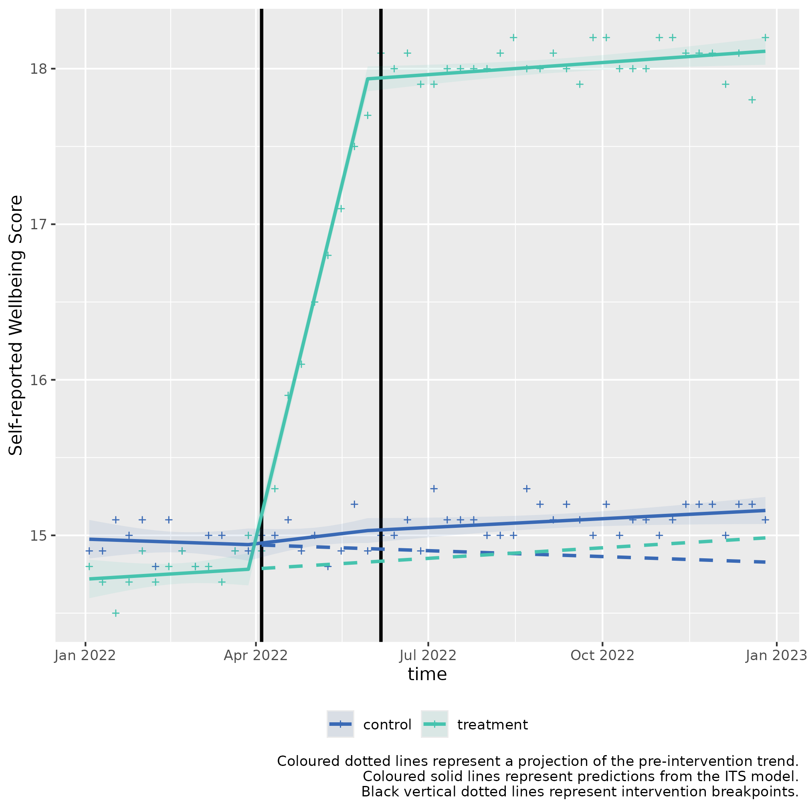

# Multiple ITS control introduction for slope change 2nd example (two-stage)

### Usage

This is a basic example which shows you how to solve a common problem
with two stage interrupted time series with a control for a slope
hypothesis:

**Background**: *Albridge Medical Practice* and *Hollybush Medical
Practice* are two medical practices within the same PCN, with similar
populations of people, and prevalence of disease.

*Albridge Medical Practice* wants to try a new intervention to improve
wellbeing in people diagnosed with depression in their practice.

This example is for scenarios where there is a statistically significant
slope change for one intervention, but no level change.

**Intervention 1: Implementing a new Mental Health Support programme**

- **Objective:** Improve mental wellbeing in patients with low-to-mid
  level depression.
- **Start Date:** April 4, 2022
- **Duration:** 2 months
- **Description:** The practice introduced weekly Mindfulness Workshops,
  teaching meditation and breathing techniques to improve
  self-regulation.
- **Measurement:** Self-reported wellbeing scores measured at start and
  end of intervention.

**Intervention 2: Introducing AI led CBT session**

- **Objective:** Further increase self-reported wellbeing scores.
- **Start Date:** June 6, 2022 (immediately after the intervention 1
  program ends)
- **Duration:** 6 months
- **Description:** The practice implements cognitive behavioural therapy
  (CBT) sessions, aimed at changing negative thought patterns and
  behaviours.
- **Measurement:** Self-reported wellbeing scores measured at start and
  end of intervention.

#### Controlled Interrupted Time Series Design (2 stage)

**Step 1: Baseline Period**

- **Duration:** 3 months (Jan 1, 2022 - April 3, 2022)
- **Data Collection:** Collect self-reported wellbeing scores.

**Step 2: Intervention 1 Period**

- **Duration:** 2 months (April 4, 2022 - June 5, 2022)
- **Data Collection:** Continue collecting self-reported wellbeing
  scores at end of workshops.

**Step 3: Intervention 2 Period**

- **Duration:** 6 months (June 6, 2022 - Dec 31, 2022)
- **Data Collection:** Continue collecting self-reported wellbeing
  scores at end of CBT.

The calendar plot below summarises the timeline of the interventions:


## Step 1) Loading data

Sample data can be loaded from the package for this scenario through the
bundled dataset `its_data_gp`.

  

  

This sample dataset demonstrates the format your own data should be in.

You can observe that in the `Date` column, that the dates are of equal
distance between each element, and that there are two rows for each
date, corresponding to either `control` or `treatment` in the
`group_var` variable. `control` and `treatment` each have three periods,
a `Pre-intervention period` detailing measurements of the outcome prior
to any intervention, the first intervention detailed by
`Intervention 1) Implementing a new Mental Health Support programme`,
and the second intervention, detailed by
`Intervention 2) Introducing CBT session`.

  

## Step 2) Transforming the data

The data frame should be passed to `multipleITScontrol::tranform_data()`
with suitable arguments selected, specifying the names of the columns to
the required variables and starting intervention time points.

``` r
intervention_dates <- c(as.Date("2022-04-04"), as.Date("2022-06-06"))
transformed_data <- 
  multipleITScontrol::transform_data(df = its_data_gp,
               time_var = "Date",
               group_var = "group_var",
               outcome_var =  "score",
               intervention_dates = intervention_dates)
```

Returns the initial data frame with a few transformed variables needed
for interrupted time series.

    #> # A tibble: 104 × 13
    #> # Groups:   category [2]
    #>    time       category  Period   outcome     x time_index level_pre_intervention
    #>    <date>     <chr>     <chr>      <dbl> <dbl>      <int>                  <dbl>
    #>  1 2022-01-03 treatment Pre-int…    14.8     1          1                      1
    #>  2 2022-01-03 control   Pre-int…    14.9     0          1                      1
    #>  3 2022-01-10 treatment Pre-int…    14.7     1          2                      1
    #>  4 2022-01-10 control   Pre-int…    14.9     0          2                      1
    #>  5 2022-01-17 treatment Pre-int…    14.5     1          3                      1
    #>  6 2022-01-17 control   Pre-int…    15.1     0          3                      1
    #>  7 2022-01-24 treatment Pre-int…    14.7     1          4                      1
    #>  8 2022-01-24 control   Pre-int…    15       0          4                      1
    #>  9 2022-01-31 treatment Pre-int…    14.9     1          5                      1
    #> 10 2022-01-31 control   Pre-int…    15.1     0          5                      1
    #> # ℹ 94 more rows
    #> # ℹ 6 more variables: level_1_intervention <dbl>,
    #> #   level_1_intervention_internal <dbl>, slope_1_intervention <dbl>,
    #> #   level_2_intervention <dbl>, level_2_intervention_internal <dbl>,
    #> #   slope_2_intervention <dbl>

## Step 3) Fitting ITS model

The transformed data is then fit using
[`multipleITScontrol::fit_its_model()`](https://herts-phei.github.io/multipleITScontrol/reference/fit_its_model.md).
Required arguments are `transformed_data`, which is simply an unmodified
object created from
[`multipleITScontrol::transform_data()`](https://herts-phei.github.io/multipleITScontrol/reference/transform_data.md)
in the step above; a defined impact model, with current options being
either ‘*slope*’, \`*level*, or ‘*levelslope*’, and the number of
interventions.

``` r
fitted_ITS_model <-
  multipleITScontrol::fit_its_model(transformed_data = transformed_data,
                                    impact_model = "slope",
                                    num_interventions = 2)

fitted_ITS_model
```

Gives a conventional model output from
[`nlme::gls()`](https://rdrr.io/pkg/nlme/man/gls.html).

    #> Generalized least squares fit by REML
    #>   Model: reformulate(termlabels = termlabels, response = "outcome") 
    #>   Data: transformed_data 
    #>   Log-restricted-likelihood: 47.55279
    #> 
    #> Coefficients:
    #>            (Intercept)                      x             time_index 
    #>           14.978016984           -0.263236823           -0.002879616 
    #>   slope_1_intervention   slope_2_intervention           x:time_index 
    #>            0.012902492           -0.005716956            0.008051684 
    #> x:slope_1_intervention x:slope_2_intervention 
    #>            0.332225275           -0.338670698 
    #> 
    #> Correlation Structure: ARMA(2,4)
    #>  Formula: ~time_index | x 
    #>  Parameter estimate(s):
    #>        Phi1        Phi2      Theta1      Theta2      Theta3      Theta4 
    #>  0.15442129  0.06585948  0.10983083  0.02821116 -0.70450272  0.31638804 
    #> Degrees of freedom: 104 total; 96 residual
    #> Residual standard error: 0.1161496

## Step 4) Analysing ITS model

However, the coefficients given do not make intuitive sense to a lay
person. We can call the package’s internal
[`multipleITScontrol::summary_its()`](https://herts-phei.github.io/multipleITScontrol/reference/summary_its.md)
which modifies the summary output by renaming the coefficients to make
them easier to interpret in the context of interrupted time series (ITS)
analysis.

``` r
my_summary_its_model <- multipleITScontrol::summary_its(fitted_ITS_model)

my_summary_its_model
```

    #> Generalized least squares fit by REML
    #>   Model: reformulate(termlabels = termlabels, response = "outcome") 
    #>   Data: transformed_data 
    #>   Log-restricted-likelihood: 47.55279
    #> 
    #> Coefficients:
    #>                           A) Control y-axis intercept 
    #>                                          14.978016984 
    #>       B) Pilot y-axis intercept difference to control 
    #>                                          -0.263236823 
    #>                     C) Control pre-intervention slope 
    #>                                          -0.002879616 
    #>                       E) Control intervention 1 slope 
    #>                                           0.012902492 
    #>                       I) Control intervention 2 slope 
    #>                                          -0.005716956 
    #> D) Pilot pre-intervention slope difference to control 
    #>                                           0.008051684 
    #>                         F) Pilot intervention 1 slope 
    #>                                           0.332225275 
    #>                         J) Pilot intervention 2 slope 
    #>                                          -0.338670698 
    #> 
    #> Correlation Structure: ARMA(2,4)
    #>  Formula: ~time_index | x 
    #>  Parameter estimate(s):
    #>        Phi1        Phi2      Theta1      Theta2      Theta3      Theta4 
    #>  0.15442129  0.06585948  0.10983083  0.02821116 -0.70450272  0.31638804 
    #> Degrees of freedom: 104 total; 96 residual
    #> Residual standard error: 0.1161496

``` r
summary(my_summary_its_model)
```

    #> Generalized least squares fit by REML
    #>   Model: reformulate(termlabels = termlabels, response = "outcome") 
    #>   Data: transformed_data 
    #>         AIC       BIC   logLik
    #>   -65.10558 -26.64035 47.55279
    #> 
    #> Correlation Structure: ARMA(2,4)
    #>  Formula: ~time_index | x 
    #>  Parameter estimate(s):
    #>        Phi1        Phi2      Theta1      Theta2      Theta3      Theta4 
    #>  0.15442129  0.06585948  0.10983083  0.02821116 -0.70450272  0.31638804 
    #> 
    #> Coefficients:
    #>                                                           Value  Std.Error
    #> A) Control y-axis intercept                           14.978017 0.07014826
    #> B) Pilot y-axis intercept difference to control       -0.263237 0.09920463
    #> C) Control pre-intervention slope                     -0.002880 0.00789916
    #> E) Control intervention 1 slope                        0.012902 0.01439202
    #> I) Control intervention 2 slope                       -0.005717 0.00954899
    #> D) Pilot pre-intervention slope difference to control  0.008052 0.01117111
    #> F) Pilot intervention 1 slope                          0.332225 0.02035339
    #> J) Pilot intervention 2 slope                         -0.338671 0.01350431
    #>                                                         t-value p-value
    #> A) Control y-axis intercept                           213.51942  0.0000
    #> B) Pilot y-axis intercept difference to control        -2.65347  0.0093
    #> C) Control pre-intervention slope                      -0.36455  0.7163
    #> E) Control intervention 1 slope                         0.89650  0.3722
    #> I) Control intervention 2 slope                        -0.59870  0.5508
    #> D) Pilot pre-intervention slope difference to control   0.72076  0.4728
    #> F) Pilot intervention 1 slope                          16.32285  0.0000
    #> J) Pilot intervention 2 slope                         -25.07872  0.0000
    #> 
    #>  Correlation: 
    #>                                                       A)Cy-i BPyidtc C)Cp-s
    #> B) Pilot y-axis intercept difference to control       -0.707               
    #> C) Control pre-intervention slope                     -0.879  0.622        
    #> E) Control intervention 1 slope                        0.657 -0.465  -0.905
    #> I) Control intervention 2 slope                       -0.277  0.196   0.563
    #> D) Pilot pre-intervention slope difference to control  0.622 -0.879  -0.707
    #> F) Pilot intervention 1 slope                         -0.465  0.657   0.640
    #> J) Pilot intervention 2 slope                          0.196 -0.277  -0.398
    #>                                                       E)Ci1s I)Ci2s DPpsdtc
    #> B) Pilot y-axis intercept difference to control                            
    #> C) Control pre-intervention slope                                          
    #> E) Control intervention 1 slope                                            
    #> I) Control intervention 2 slope                       -0.852               
    #> D) Pilot pre-intervention slope difference to control  0.640 -0.398        
    #> F) Pilot intervention 1 slope                         -0.707  0.602 -0.905 
    #> J) Pilot intervention 2 slope                          0.602 -0.707  0.563 
    #>                                                       F)Pi1s
    #> B) Pilot y-axis intercept difference to control             
    #> C) Control pre-intervention slope                           
    #> E) Control intervention 1 slope                             
    #> I) Control intervention 2 slope                             
    #> D) Pilot pre-intervention slope difference to control       
    #> F) Pilot intervention 1 slope                               
    #> J) Pilot intervention 2 slope                         -0.852
    #> 
    #> Standardized residuals:
    #> numeric(0)
    #> attr(,"label")
    #> [1] "Standardized residuals"
    #> 
    #> Residual standard error: 0.1161496 
    #> Degrees of freedom: 104 total; 96 residual

``` r
sjPlot::tab_model(
  my_summary_its_model,
  dv.labels = "Self-reported Wellbeing Score",
  show.se = TRUE,
  collapse.se = TRUE,
  linebreak = FALSE,
  string.est = "Estimate (std. error)",
  string.ci = "95% CI",
  p.style = "numeric_stars"
)
```

[TABLE]

The predictor coefficients elucidate a few things:

### **Pre-intervention period:**

At the start of the pre-intervention period, ***A)*** ***Control y-axis
intercept*** represents the modelled starting score of Hollybush Medical
Practice, 14.98.

***C) Control pre-intervention slope*** describes the pre-intervention
slope in the control group (0).

***D) Pilot pre-intervention slope difference to control*** describes
the difference in the pre-intervention slope in the pilot group with the
control group. This coefficient is additive to C) ***Control
pre-intervention slope***. I.e. 0 (C) + 0.01 (D) = 0.01 is the
pre-intervention slope per x-axis unit in the pilot data.

### **First intervention**:

***E) Control intervention 1 slope*** describes the slope change that
occurs at the intervention break point in the control group at the start
of the first intervention, compared to it’s pre-intervention period
(0.01).

***F) Pilot intervention 1 slope*** describes the difference in the
slope change that occurs at the intervention timepoint in the pilot
group for the first intervention compared to the control (0.33).

These slope changes are pertinent to the slope gradients given in the
pre-intervention period. Thus, we add the coefficients ***E)***
***Control intervention 1 slope** to **C)*** ***Control pre-intervention
slope***: 0.01 + 0 = 0.01 is the average increase for each x-axis unit
during the first intervention for the control data.

To ascertain the slope for the pilot data, we add to the
pre-intervention slope of the pilot data, the coefficients ***E)***
***Control intervention 1 slope*** and ***F)*** ***Pilot intervention 1
slope***. ***E*** (0.01) + ***F*** (0.33) + ***(C)*** 0 + ***D*** 0.01
(D) = 0.35 is the average increase for each x-axis unit during the first
intervention for the pilot data.

To ascertain statistical significance with the first intervention slope,
we call the function’s
[`multipleITScontrol::slope_difference()`](https://herts-phei.github.io/multipleITScontrol/reference/slope_difference.md).

``` r
slope_difference(model = my_summary_its_model, intervention = 1)
```

    #> ## INTERVENTION  1 ## 
    #> 
    #>  Slope for treatment per x-axis unit: 0.35 
    #>  Slope for control per x-axis unit: 0.01 
    #>  Slope difference: 0.34 
    #>  95% CI: 0.32 to 0.36 
    #>  p-value: <0.001 
    #>  Slope control coefficients: E+C 
    #>  Slope treatment coefficients: E+C+D+F 
    #> 
    #> # A tibble: 9 × 3
    #>   Variable                     Value_Raw Value_Formatted
    #>   <chr>                            <dbl> <chr>          
    #> 1 Intervention                  1   e+ 0 1              
    #> 2 Slope for treatment           3.50e- 1 0.35           
    #> 3 Slope for control             1.00e- 2 0.01           
    #> 4 Slope difference              3.40e- 1 0.34           
    #> 5 Lower 95% CI                  3.18e- 1 0.32           
    #> 6 Upper 95% CI                  3.63e- 1 0.36           
    #> 7 p.value                       9.80e-51 <0.001         
    #> 8 Slope treatment coefficients NA        E+C+D+F        
    #> 9 Slope control coefficients   NA        E+C

This brings up the key coefficients and values needed to compare the
slopes of the pilot and control during the first intervention.

We identify that the slope difference between the treatment (Albridge
Medical Practice) and the control (Hollybush Medical Practice) for the
first intervention (Reading Programme) has a slope difference of 0.34
(95% CI: 0.32 - 0.36) per x-axis unit, with a p-value of \<0.001,
indicating statistical significance.

### **Second intervention:**

***I) Control intervention 2 slope*** describes the slope change that
occurs at the intervention break point in the control group at the start
of the second intervention (-0.01).

Thus, the modelled slope change in the second intervention is ***C)
Control pre-intervention slope*** (0) + **E) Control intervention 1
slope** (0.01) + ***I) Control intervention 2 slope*** (-0.01) = 0 is
the average cumulative uptake increase for each x-axis unit during the
second intervention for the control data.

***J) Pilot intervention 2 slope*** describes the difference in the
slope change that occurs at the intervention timepoint in the pilot
group for the second intervention. (-0.34).

These slope changes are pertinent to the slope gradients given in the
pre-intervention and first intervention period. Thus, we add the
coefficients ***C*** (0) + ***D*** (0.01) + ***E*** (0.01) + ***F***
(0.33) + ***I*** (-0.01) + ***J*** (-0.34) = 0 is the average cumulative
increase for each x-axis unit during the second intervention for the
pilot data.

To ascertain statistical significance with the second intervention
slope, we call the function’s
[`multipleITScontrol::slope_difference()`](https://herts-phei.github.io/multipleITScontrol/reference/slope_difference.md)
again, but change the intervention parameter.

``` r
slope_difference(model = my_summary_its_model, intervention = 2)
```

    #> ## INTERVENTION  2 ## 
    #> 
    #>  Slope for treatment per x-axis unit: 0.01 
    #>  Slope for control per x-axis unit: 0 
    #>  Slope difference: 0 
    #>  95% CI: -0.01 to 0.01 
    #>  p-value: 0.636 
    #>  Slope control coefficients: E+C+I 
    #>  Slope treatment coefficients: E+C+D+F+I+J 
    #> 
    #> # A tibble: 9 × 3
    #>   Variable                     Value_Raw Value_Formatted
    #>   <chr>                            <dbl> <chr>          
    #> 1 Intervention                   2       2              
    #> 2 Slope for treatment            0.00591 0.01           
    #> 3 Slope for control              0.00431 0              
    #> 4 Slope difference               0.00161 0              
    #> 5 Lower 95% CI                  -0.00511 -0.01          
    #> 6 Upper 95% CI                   0.00832 0.01           
    #> 7 p.value                        0.636   0.636          
    #> 8 Slope treatment coefficients  NA       E+C+D+F+I+J    
    #> 9 Slope control coefficients    NA       E+C+I

We identify that the slope difference between the treatment (Albridge
Medical Practice) and the control (Hollybush Medical Practice) for the
second intervention (Reading Programme) has a slope difference of 0 (95%
CI: -0.01 - 0.01) per x-axis unit, with a p-value of 0.636, indicating a
non statistically significant result. The effect has been attenuated
compared to the first intervention, and this is evident from the plot in
step 6.

## Step 5) Fitting Predictions

We can fit predictions with the created model which project the
pre-intervention period into the post-intervention period by using the
model coefficients using
[`multipleITScontrol::generate_predictions()`](https://herts-phei.github.io/multipleITScontrol/reference/generate_predictions.md).

``` r
transformed_data_with_predictions <- generate_predictions(transformed_data, fitted_ITS_model)

transformed_data_with_predictions
```

### Step 6) Plotting the results

We can use the predicted values and map the segmented regression lines
which compare whether an intervention had a statistically significant
difference.

``` r
its_plot(model = my_summary_its_model,
         data_with_predictions = transformed_data_with_predictions, 
         time_var = "time",
         intervention_dates = intervention_dates, 
         y_axis = "Self-reported Wellbeing Score")
```



In this example, the treatment variable is for *Albridge Medical
Practice*, whilst the control is for *Hollybush Medical Practice*. The
treatment slope shows there was a significant slope change immediately
after the first intervention in April 2022, but not in the second
intervention in June 2022.
